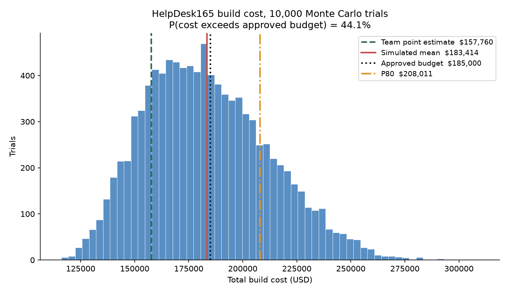
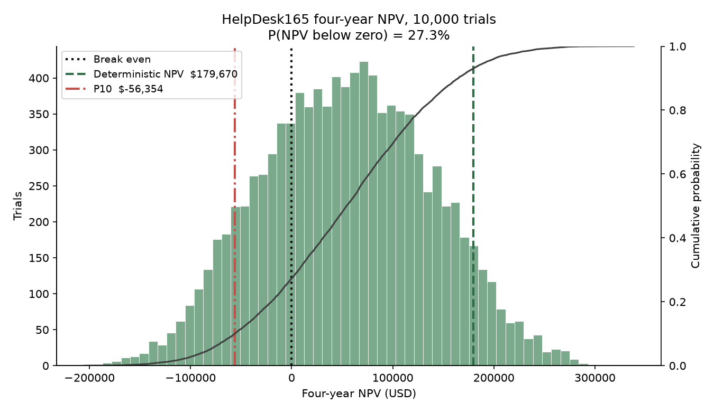
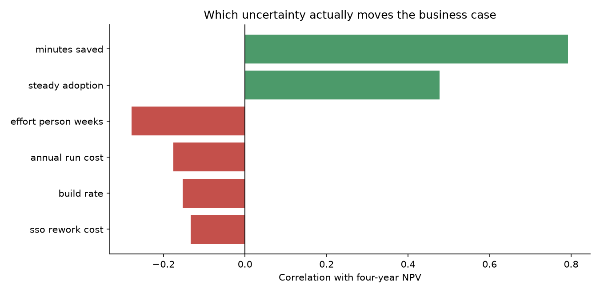

# HelpDesk165 — Project Report

**CMPE 165 — Software Engineering Process Management**

**Project 1: Software Product from Idea to Execution**

**Instructor:** Dhruba Borthakur

**Due:** Tuesday, September 22, 2026

**Product:** HelpDesk165

**Organization:** SJSU Campus Technology Services (CTS)

**GitHub:** https://github.com/Seaphant/Help-Desk-165

**Team:** W. Nguyen (github.com/Seaphant) · **ADD REMAINING TEAMMATE NAMES HERE BEFORE SUBMITTING**

**Recommendation: GO WITH CONDITIONS**

Tables, charts, equations, and the calculation appendix do not count toward 5,000 words. Figures in Parts C–J come from analysis/ (python -m analysis.run_all). The workbook is the calculation appendix. Body word count: 4,489, within the 5,000-word limit.

## Contents

- [Where each graded requirement is answered](#where-each-graded-requirement-is-answered)
- [The product we actually built](#the-product-we-actually-built)
- [Part A — Mission and Strategic Alignment](#part-a-mission-and-strategic-alignment)
- [Part B — Stakeholders, Organization, and Culture](#part-b-stakeholders-organization-and-culture)
- [Part C — Project Selection](#part-c-project-selection)
- [Part D — Financial Analysis](#part-d-financial-analysis)
- [Part E — Leadership and Ethics](#part-e-leadership-and-ethics)
- [Part F — Team Design](#part-f-team-design)
- [Part G — Conflict and Negotiation](#part-g-conflict-and-negotiation)
- [Part H — Risk Identification](#part-h-risk-identification)
- [Part I — Decision Tree](#part-i-decision-tree)
- [Part J — Monte Carlo Simulation](#part-j-monte-carlo-simulation)
- [Part K — Risk Mitigation and Monitoring](#part-k-risk-mitigation-and-monitoring)
- [What vibe coding taught us](#what-vibe-coding-taught-us)
- [Final recommendation](#final-recommendation)
- [Classroom presentation and Loom](#classroom-presentation-and-loom)

## Where each graded requirement is answered

**Reading guide. The 100-point rubric mapped to sections of this report and files in the repository.**

| Graded area | Points | Where it is answered |
| --- | --- | --- |
| Problem, mission, strategy, stakeholders | 8 | Part A, Part B1 |
| Organizational structure and culture | 7 | Part B2, Part B3 |
| Project selection and weighted scoring | 8 | Part C, Table 3 |
| Financial analysis / NPV | 8 | Part D, Table 4 |
| Leadership and ethics | 8 | Part E |
| Team structure, conflict, negotiation | 8 | Part F, Part G, Table 5 |
| Risk identification and risk register | 8 | Part H, Table 6 |
| Decision-tree analysis | 8 | Part I |
| Monte Carlo analysis | 8 | Part J, Tables 7-9, Figures 1-3 |
| Working software prototype | 10 | Repository: app/, run streamlit run app/Home.py |
| GitHub repository and AI-development reflection | 5 | README.md, section 'AI-Assisted Development' |
| Loom demo | 5 | Submitted separately, max 4 minutes |
| Final recommendation and classroom presentation | 7 | 'Final recommendation' section; 4-slide deck |

**Every figure in Parts C, D, H, I, and J is produced by the scripts in analysis/ and regenerated with a single command, so the numbers in this report, the slides, and the calculation workbook cannot drift apart.**

## The product we actually built

HelpDesk165 is a working campus IT help-desk prototype, not a production platform. We built it to apply Lectures 1–6 and answer one question: should CTS keep investing, and can it execute?

The prototype demonstrates four user interactions, which is more than the required two:

1. **Submit a ticket.** A requester enters a summary, details, category, and priority. The system assigns a support-hour SLA target and returns a tracking number.
1. **Search and filter the queue.** Agents (and requesters, scoped to their own email) search by keyword or ticket number and filter by status, priority, category, and owner. Saved views cover unassigned work and SLA trouble.
1. **Update a ticket.** An agent assigns an owner, changes status or priority, and leaves a timestamped work note. Every field change is written to an audit trail. Requesters can comment; they cannot reassign.
1. **Read and export a dashboard.** Managers see volume by category, SLA outcome by priority, weekly intake, and open load by owner, then download a CSV whose columns match the screen.
The stack is Python, Streamlit, SQLite, pandas, and Altair. First run seeds 62 tickets and six agents. There is no real authentication, Banner integration, or cloud deployment. Those omissions are the production risks the rest of this report prices.

The prototype works. A deterministic four-year NPV of **$179,670** is still the wrong number to fund against. Ten thousand trials put expected NPV at **$54,286**, with a **27.3%** chance the investment never pays back and a **44.1%** chance the build exceeds the **$185,000** capital budget. Adoption, not code, is the swing variable. That is why we recommend a paid pilot with a stop gate.

## Part A — Mission and Strategic Alignment

### A1. Mission

SJSU Campus Technology Services keeps teaching, learning, and campus operations running on reliable technology. The division is funded to restore service and to prove that it did — not to operate a shared inbox.

### A2. Problem

A faculty member whose projector dies in BBC 202 emails a shared inbox, copies a colleague, and sometimes logs the same request on a departmental spreadsheet. Agents triage by scrolling. There is no single queue, no named owner, no support-hour SLA clock, and no number the monthly service review can defend. Unassigned tickets go stale. An urgent classroom failure sits next to a password reset. Faculty, students, staff, and agents live this. Leadership cannot say what share of tickets missed target last month.

### A3. Project Objective

HelpDesk165 gives CTS one intake path, one queue, and one SLA clock. A requester describes the problem once and gets a tracking number. An agent searches, filters, assigns, updates status, and leaves a work note. A manager sees volume, slippage, and load, and can export a report that traces every figure back to a ticket. Production would add SSO, a real database, roster sync, and access control. The prototype proves the operating idea.

### A4. Strategic Alignment

CTS strategy is measurable service quality, not a larger tool catalog.

- **Productivity.** Structured intake removes the “please send a screenshot” loop. Category routing removes hand-assignment.
- **Cost.** One campus tool retires three departmental trackers.
- **Reliability.** A request in one system cannot vanish between inbox and spreadsheet.
- **Customer experience.** A tracking number and a visible status beat hoping someone saw the email.
This is an operations project. It protects teaching time and makes the service review honest.

### A5. Success Metrics

Three would satisfy the assignment. We track four because intake share is the variable the Monte Carlo says actually moves NPV.

1. **SLA compliance** on closed tickets of at least **90%** within two semesters of a campus-wide launch.
1. **Median time from submit to first assignment** of **2 support hours or less** for High and Urgent tickets.
1. **Intake share** — tickets created in HelpDesk165 divided by all CTS requests, including leftover email and walk-ups — of at least **80%** by the end of year two.
1. **Unassigned open tickets** at or below **5%** of the live queue, measured every Monday.
If intake share stalls, the labor savings that justify the investment do not exist. Metric 3 is therefore a launch gate, not a vanity number.

## Part B — Stakeholders, Organization, and Culture

### B1. Stakeholders

**Table 1. Stakeholder analysis: wants, influence, interest, and stance.**

| Stakeholder | What they want | Influence | Interest | Stance |
| --- | --- | --- | --- | --- |
| CTS Director (sponsor) | A service-review number that survives a VP question; no surprise budget overrun | High | High | Support |
| Help-desk agents and leads | A queue that is faster than the inbox, without a form that requesters will refuse to fill | Medium | High | Support, with conditions |
| Faculty and student requesters | A 30-second submit and a tracking number during a live failure | Low–Medium | High | Support if intake stays short; resist if it does not |
| Vice President for Information Technology | No FERPA incident; no supplemental capital request | High | Medium | Support if risk is bounded; resist an open-ended build |
| Campus privacy officer | Role-based access before any real student record is stored | High | Medium | Resist a launch that skips access control |
| Student assistants (Tier 1) | Clear ownership and a queue they can work without tribal knowledge | Low | Medium | Support |
| Department chairs who own the three current trackers | To stop paying for a tool their staff barely use — or to keep it if the new one is worse | Medium | Medium | Mixed; a source of resistance if they are not in the pilot |

**Power–interest matrix**

**Table 2. Power-interest matrix.**

|  | Low interest | High interest |
| --- | --- | --- |
| High power | Keep satisfied: VP for IT; campus privacy officer | Manage closely: CTS Director; help-desk leads |
| Low power | Monitor: casual one-time student requesters | Keep informed: agents, student assistants, faculty who file often |

The privacy officer is most likely to stop the project, and should. Agents are most likely to quietly kill it by keeping the inbox “just through the transition.” Those two facts drive Parts E, G, and K.

### B2. Organizational Structure

The appropriate structure is a **matrix**.

CTS is a functional IT organization. The production team should borrow two engineers, a service owner, and part-time design and QA from existing groups rather than stand up a permanent projectized unit for a one-year build. Functional managers keep the help desk staffed. A project manager owns the date and the scope cut.

**Why not functional-only?** No one would own the product. It would become “the thing the desk does when they have time,” which is how the spreadsheets happened.

**Why not projectized?** CTS cannot pull a dedicated unit for a year without hollowing out the desk that still has to answer the inbox.

**Advantage.** Expertise stays after launch. The people who will operate the queue help design it.

**Disadvantage.** Dual reporting. A functional manager can pull an engineer onto an outage and the schedule slips — risk R2. The PM needs written pull-protection through the pilot.

### B3. Organizational Culture

Three characteristics would help.

1. **Service-first instinct.** Agents already care about the requester in front of them. A tool that shortens that path will be used. A tool that makes agents feel like data-entry clerks will not.
1. **Willingness to be measured.** CTS already holds a monthly service review. An SLA dashboard has a home. Organizations that do not already meet about numbers will not start because a chart exists.
1. **Student-employment tradition.** Structured intake and a real queue make Tier 1 student assistants useful. That is cheap, renewable capacity once the work is visible.
One characteristic would hurt: **inbox culture.** “Just email us” is how CTS currently proves it is helpful. If the new tool is an extra place to file rather than the only place, the business case is fiction.

## Part C — Project Selection

Management cannot fund every project. The competing alternative is **Project B — a campus room and equipment booking portal**. It is a real CTS pain. It is also a calendar-and-inventory problem that touches facilities, and it does not give the service review a number.

Weights total 100%. Scores are 1–10. Weighted score = weight × score.

**Table 3. Weighted scoring model. Weights total 100 percent; scores are 1-10.**

| Criterion | Weight | A score | A weighted | B score | B weighted |
| --- | --- | --- | --- | --- | --- |
| Strategic alignment | 25% | 9 | 2.25 | 6 | 1.50 |
| Expected financial return | 20% | 8 | 1.60 | 7 | 1.40 |
| Time to first value | 15% | 9 | 1.35 | 5 | 0.75 |
| Delivery and technical risk | 15% | 7 | 1.05 | 6 | 0.90 |
| Stakeholder demand and sponsorship | 15% | 9 | 1.35 | 6 | 0.90 |
| Staffing feasibility | 10% | 8 | 0.80 | 5 | 0.50 |
| Total | 100% |  | 8.40 |  | 5.95 |

**Management should choose Project A (HelpDesk165).** The margin is 2.45 points on a 10-point scale.

Score notes, so the table is not just a preference dressed as arithmetic:

- **Strategic alignment (A 9 / B 6).** CTS is funded against service quality. A queue with an SLA clock is that goal. A booking portal is adjacent.
- **Financial return (A 8 / B 7).** A’s deterministic NPV is positive and the savings sit in CTS’s own labor. B’s savings are real but shared with facilities and harder to capture.
- **Time to first value (A 9 / B 5).** A usable slice of HelpDesk165 already exists. A booking portal has to be correct for every room on day one or faculty will not trust it.
- **Delivery risk (A 7 / B 6).** Higher means safer. A’s technical risk is SSO and a database migration. B’s is inventory truth across two divisions.
- **Sponsorship (A 9 / B 6).** The CTS Director wants the service-review number. Booking has no single sponsor.
- **Staffing (A 8 / B 5).** This team just built A’s prototype. B needs facilities-side analysts CTS does not have.
A reviewer will say we weighted our favorite criterion. We checked. No reallocation of any single weight between 0% and 100% makes Project B win.

## Part D — Financial Analysis

The university IT hurdle rate is **8%**. Benefits run **four years**. Labor and tool savings scale by an adoption ramp (55% / 90% / 100% / 100%). The **$26,000** run cost is charged in full from year one because hosting does not wait for adoption.

### Initial development cost

Engineering labor is 38 person-weeks × 40 hours × $88 loaded = **$133,760**.

One-time non-labor costs: Okta/Duo and Banner roster sync $12,000; security and accessibility review $8,000; managed Postgres, CI, and monitoring $4,000. Total fixed = **$24,000**.

**Initial development cost C₀ = $157,760.**

That sits under the **$185,000** Director-approved capital budget. Part J shows this comparison is the wrong one.

### Annual benefits

Campus volume is 24,000 tickets today, growing 5% as more departments come on. Each ticket that flows through the tool saves **10 minutes** of staff time at a **$32** blended loaded rate (student assistants at ~$22 and Tier 2 at ~$48, weighted by mix). Full-volume labor saving in year 1 is 24,000 × (10/60) × 32 = **$128,000** before adoption. Three retired departmental trackers add **$12,000** a year before adoption.

### Net present value

NPV = -C₀ + Σ (t = 1 to 4) Bₜ / (1 + r)ᵗ

where Bₜ is net cash flow in year t (adopted gross benefit minus run cost) and r = 0.08. Discount factors are 1/(1.08)^t.

**Table 4. Four-year NPV at an 8 percent discount rate. Present value = net cash flow x discount factor.**

| Year | Volume | Adoption | Labor savings | Tool savings | Gross | Run cost | Net flow | DF | Present value |
| --- | --- | --- | --- | --- | --- | --- | --- | --- | --- |
| 0 |  |  |  |  |  |  | −157,760 | 1.00000 | −157,760 |
| 1 | 24,000 | 55% | 70,400 | 6,600 | 77,000 | −26,000 | 51,000 | 0.92593 | 47,222 |
| 2 | 25,200 | 90% | 120,960 | 10,800 | 131,760 | −26,000 | 105,760 | 0.85734 | 90,672 |
| 3 | 26,460 | 100% | 141,120 | 12,000 | 153,120 | −26,000 | 127,120 | 0.79383 | 100,912 |
| 4 | 27,783 | 100% | 148,176 | 12,000 | 160,176 | −26,000 | 134,176 | 0.73503 | 98,623 |
| NPV |  |  |  |  |  |  |  |  | 179,670 |

Sum of year 1–4 present values = $337,430. Minus $157,760 = **NPV = $179,670**.

ROI on invested capital = 114%. IRR ≈ 45%, well above the 8% hurdle. Simple and discounted payback both fall in **year 3**.

**Based only on NPV, management should fund this project.** Value is positive, the hurdle is cleared, and payback is inside the window.

That sentence is incomplete. $179,670 uses the mode of every input, not the mean. Effort is right-skewed. Adoption can stall. Part J exists because this table is the optimistic story.

## Part E — Leadership and Ethics

### E1. Leadership

The right style is **facilitative leadership with a hard schedule spine** — closer to servant leadership than to command-and-control, but not a democracy about scope.

- **How decisions are made.** Product behavior belongs to the CTS service owner. How to build belongs to the tech lead. The date and the scope cut belong to the project manager. Those three lanes are written down. A Slack poll is not a decision.
- **How much authority team members have.** Engineers choose implementation inside an accepted story. They do not add a knowledge base because a chair asked for one. Design owns the intake form. QA can block a release if an SLA number cannot be traced to tickets.
- **How disagreements are handled.** The two owners write the disagreement on a decision log within 24 hours. If they still disagree, the CTS Director decides. The loudest engineer does not.
- **What the PM does if the project falls behind.** Cut scope, not sleep. The pre-agreed cut is the Banner roster sync, replaced by a nightly CSV that the team already estimated at one week instead of five. Asking student assistants to work nights is how you get both a late project and a FERPA incident.

### E2. Leadership Antipattern

**Heroic firefighting.** The lead agent keeps the shared inbox alive “just through the transition” because that is how CTS has always absorbed pain. Departments never have to move. The labor savings never appear. The people who should have been the product’s champions are too busy to use it. The tool launches to an empty queue, and the business case dies. This is risk R3 wearing a leadership badge.

A close second is the **feature-factory PM** who accepts every request to keep the room friendly. That is how four features become a knowledge base, chat, and a mobile app (R7) and then miss the change freeze (R2).

### E3. Ethical Challenge

A faculty member pastes a student ID, a grade dispute, and a disability-accommodation note into a ticket body. The prototype has no access control. A student assistant on Tier 1 can open it.

**The ethical problem.** FERPA-protected information is visible to people with no need to know. The student did not consent to that audience. The student worker did not ask to hold that information.

**Stakeholders affected.** The student; the faculty member; CTS; the campus privacy officer; the student assistant; the university, if this becomes a reportable disclosure.

**What the project manager should do.** Treat it as a stop-the-line defect, not a launch-checklist item. No real ticket is accepted until role-based access is in, ticket visibility is limited to the requester plus assigned agents, the intake form tells people not to paste student IDs or grades, and the campus security review is booked. “We will add auth later” is the unethical shortcut, and it is also how the project fails its pre-launch review (risk R5).

## Part F — Team Design

The hypothetical professional team that would build the full product:

**Table 5. Production team roles and what each role owns.**

| Role | Owns |
| --- | --- |
| CTS service owner (product) | Requirements. What “done” means for a requester and for the service review. |
| Tech lead | Technical decisions: data model, SSO approach, what is hardcoded versus configurable. |
| Two engineers | Delivery. One owns intake and the queue; one owns SLA math and reporting. That split exists because risk R4 is a single person understanding the clock. |
| Part-time designer | The 30-second intake form. If this role is skipped, Part G’s conflict comes back as a launch failure. |
| Part-time QA | Quality, jointly with the tech lead. An SLA number that cannot be traced to tickets is a failed build, not a cosmetic bug. |
| Project manager | Schedule, scope cut, risk register, the pilot gate. |

Disagreements that stay inside a lane are resolved by the lane owner. Disagreements that cross lanes go to the decision log, then the CTS Director. They are not resolved by working longer.

**Hybrid, not co-located and not fully distributed.** CTS is a physical help desk. Classroom tickets need walk-up empathy. The core team is on campus two days a week; the rest is remote. Fully distributed loses the hallway conversations that are currently the requirements process. Fully co-located fights student-employee calendars and is unnecessary for six people.

## Part G — Conflict and Negotiation

**The disagreement.** Classroom Technology wants building, room, podium ID, capture system, and course CRN required on every ticket. Faculty teaching a live class will not complete a seven-field form while forty students wait. Agents say they walk into the wrong room without those fields. Faculty say they will go back to email.

**What each side wants.** Agents want first-time fix and a complete record. Faculty want the class restored in the next five minutes and a tracking number they can forward to a colleague.

**Why the conflict exists.** The two sides are measured on different things. That is not stubbornness. It is two rational local optima.

**How the PM should resolve it.** Do not pick a winner and do not average the form into something that serves neither side. Separate *submit* from *triage*.

**The negotiated solution.** Urgent and Classroom Technology tickets require only a summary plus building and room. Podium ID, capture system, and CRN are completed at triage, pre-filled when the room is known. Faculty keep a 30-second submit. Agents have the data before they walk. The inbox is closed for those categories in the pilot so email is not an escape.

## Part H — Risk Identification

Score = Probability × Impact on a 1–5 scale. Exposure = quantitative probability × dollar impact. The register is ranked on exposure. Nine risks, eight categories.

**Table 6. Risk register, ranked by dollar exposure (probability x dollar impact).**

| ID | Category | Risk | P | I | P×I | Band | Prob. | $ impact | Exposure |
| --- | --- | --- | --- | --- | --- | --- | --- | --- | --- |
| R3 | Adoption | Departments keep the inbox and spreadsheets; the labor savings never appear | 3 | 5 | 15 | Critical | 30% | 95,000 | 28,500 |
| R2 | Schedule / Cost | Effort is underestimated; the build misses the change freeze and the capital budget | 5 | 4 | 20 | Critical | 45% | 42,000 | 18,900 |
| R5 | Security / Compliance | FERPA data in tickets; no access control; failed security review | 3 | 5 | 15 | Critical | 25% | 60,000 | 15,000 |
| R7 | Scope | Knowledge base, live chat, and a mobile app become launch requirements | 4 | 3 | 12 | High | 45% | 30,000 | 13,500 |
| R1 | Technical | Okta/Duo and Banner take much longer because campus identity APIs are undocumented | 4 | 4 | 16 | Critical | 35% | 34,000 | 11,900 |
| R4 | People | Only one engineer understands the SLA and reporting logic | 3 | 4 | 12 | High | 30% | 22,000 | 6,600 |
| R8 | Quality | SLA math ships untested; a wrong number appears in the service review | 3 | 4 | 12 | High | 30% | 20,000 | 6,000 |
| R9 | Architecture | SQLite does not survive concurrent campus use and must be migrated mid-project | 3 | 3 | 9 | Moderate | 30% | 16,000 | 4,800 |
| R6 | External | Canvas/Banner summer upgrades break the roster sync | 2 | 4 | 8 | Moderate | 20% | 18,000 | 3,600 |

Total expected exposure = **$108,800**.

**Highest-priority risks: R3 adoption**, **R2 schedule/cost**, **R5 FERPA**. R2 has the highest qualitative score (20). R3 has the highest dollar exposure because failed adoption costs the business case, not a sprint. We rank on exposure. Part K treats these three. R1 is fourth and appears in the Monte Carlo as a 35% chance of SSO rework.

## Part I — Decision Tree

**The decision.** How should CTS fund the production version: build it now, license a commercial ITSM product, or pay for an eight-week pilot and decide afterwards?

Each branch has two outcomes. Probabilities on a branch sum to 1. Expected monetary value:

EMV = Σᵢ pᵢ × Vᵢ

**Build the full product now** (commit ~$158K immediately)

- 60% campus-wide adoption holds → $205,000. Contribution: 0.60 × 205,000 = $123,000
- 40% adoption stalls → −$95,000. Contribution: 0.40 × −95,000 = −$38,000
- **EMV = $85,000.** Worst case: −$95,000.
**License a commercial ITSM product** ($58K/year plus $30K implementation)

- 55% the product fits as sold → $120,000. Contribution: $66,000
- 45% heavy customization is required → $15,000. Contribution: $6,750
- **EMV = $72,750.** Worst case: $15,000 (no loss, but almost no gain).
**Fund an eight-week paid pilot, then decide** (spend $46,000 first)

- 65% the pilot validates demand, then we build → $176,000. Contribution: $114,400
- 35% it does not, and we stop → −$46,000. Contribution: −$16,100
- **EMV = $98,300.** Worst case: −$46,000.
```text
                    ┌─ 60% adoption holds ────────── +$205,000
 Build now          │
 EMV $85,000        └─ 40% adoption stalls ───────── −$95,000

                    ┌─ 55% fits as sold ──────────── +$120,000
 License ITSM       │
 EMV $72,750        └─ 45% heavy customization ───── +$15,000

                    ┌─ 65% pilot works, then build ─ +$176,000
 Pilot then decide  │
 EMV $98,300        └─ 35% stop after pilot ──────── −$46,000
```

**Management should fund the eight-week paid pilot.** It has the highest EMV ($98,300), $13,300 above building now, and it caps the downside at the pilot cost instead of at a failed full build. Licensing looks safer on the worst case and is the worst decision on EMV: CTS would pay forever for a tool that does not match campus process.

The 65% / 35% split on the pilot is a judgment. Even if those probabilities are wrong by a wide margin, the pilot still wins on downside: the organization finds out whether anyone will use the tool before it spends the other $112,000.

## Part J — Monte Carlo Simulation

The NPV in Part D uses one number for every input. That number is the mode. Because software effort overruns more than it underruns, the mean cost is higher than the estimate, and the mean NPV is much lower than $179,670.

**Uncertain variables (six; the assignment asks for at least three)**

**Table 7. Monte Carlo input distributions, six uncertain variables.**

| Variable | Distribution | Parameters |
| --- | --- | --- |
| Engineering effort (person-weeks) | Triangular | 30 / 38 / 62 |
| Blended loaded build rate ($/hr) | Normal, clipped | mean 88, sd 7, clipped [70, 118] |
| SSO / Banner rework ($) | Bernoulli × triangular | 35% chance, then 8,000 / 15,000 / 34,000 |
| Minutes saved per ticket | Triangular | 4 / 10 / 14 |
| Steady-state adoption share | Triangular | 55% / 92% / 100% |
| Annual run cost ($) | Uniform | 20,000 to 34,000 |

**10,000 trials**, seed 165, so the charts and the appendix regenerate to the same numbers.

**Build cost**

**Table 8. Simulated total build cost, 10,000 trials.**

| Result | Value |
| --- | --- |
| Team point estimate | $157,760 |
| Simulated mean | $183,414 |
| Median (P50) | $180,823 |
| Best-ish case (P10) | $148,459 |
| P80 | $208,011 |
| Worst-ish case (P90) | $222,742 |
| Optimism gap (mean − estimate) | $25,654 |
| P(cost > $185,000 approved budget) | 44.1% |

**Four-year NPV**

**Table 9. Simulated four-year NPV, 10,000 trials.**

| Result | Value |
| --- | --- |
| Deterministic NPV | $179,670 |
| Simulated mean | $54,286 |
| Median (P50) | $54,332 |
| Worst-ish case (P5) | −$81,196 |
| P10 | −$56,354 |
| Best-ish case (P95) | $191,976 |
| P(NPV < 0) | 27.3% |

Figures 1 through 3 are reproduced below. They are generated by analysis/monte_carlo.py and written to analysis/outputs/, so rerunning python -m analysis.run_all reproduces them exactly from seed 165.



**Figure 1. Build-cost distribution against the point estimate, the mean, P80, and the $185,000 approval ceiling.**



**Figure 2. Four-year NPV distribution. The deterministic $179,670 sits in the right tail; expected NPV is $54,286.**



**Figure 3. Which uncertain inputs actually move NPV. Minutes saved and adoption dominate; engineering effort does not.**

The tornado chart says what actually moves the business case. Minutes saved per ticket explain about **63%** of NPV variance. Steady-state adoption explains about **23%**. Engineering effort, the thing teams usually pad, explains about **8%**. CTS is not mainly buying a software project. It is buying a behavior change.

**What management decision should change.** Do not fund the full build on the $157,760 point estimate or the $179,670 NPV. Hold capital against the **P80 cost (~$208,000)**, which means a supplemental request or a written contingency the Director can release. And do not skip the pilot. The two variables that dominate NPV — minutes saved and adoption — are exactly what an eight-week pilot measures, and they are cheap to measure relative to a $158K–$208K build.

## Part K — Risk Mitigation and Monitoring

The three highest-exposure risks, with a response that a PM can actually run.

**R3 — Adoption (exposure $28,500)**

- **Mitigation.** Do not build campus-wide first. Run the eight-week paid pilot in Classroom Technology and Canvas support. Close the shared inbox for those two categories so the tool is the only intake path. Publish the SLA dashboard to that department’s own leadership. Name a department champion who is accountable for intake share, not the project team.
- **Contingency.** If intake share is under 60% at week four, stop feature work and spend the remaining pilot weeks on the adoption blocker. If it is still under 60% at week eight, invoke the decision-tree stop branch. CTS loses $46,000 rather than $158,000.
- **Early warning.** Weekly intake share: HelpDesk165 tickets ÷ all requests in the pilot categories, including leftover email and walk-ups.
**R2 — Schedule / cost (exposure $18,900)**

- **Mitigation.** Budget to the simulation’s P80, not the point estimate. Timebox the SSO spike to two weeks. Fix launch scope in writing at the four features the pilot validated. Track sprint velocity from sprint one.
- **Contingency.** A pre-approved contingency the Director can release without a new funding request. If velocity misses twice, cut roster sync to a nightly CSV.
- **Early warning.** Two consecutive sprints below 70% of committed points, or the integration spike passing its timebox without a working token exchange.
**R5 — FERPA / access control (exposure $15,000)**

- **Mitigation.** Role-based access before the pilot handles a real ticket. Ticket visibility limited to the requester plus assigned agents. Standing notice on the form: do not paste student IDs or grades. Book the campus security review at project start, not before launch.
- **Contingency.** If the review finds a defect, the pilot pauses. Affected tickets are purged and re-created without the sensitive field. A path to the privacy officer exists before the pilot opens.
- **Early warning.** Any automated hit for a nine-digit student ID in a ticket body, or an access-log read by an account that is neither requester nor assignee.
**How the PM monitors.** A thirty-minute risk review every Monday: intake share, velocity, FERPA scan, and whether any new “must-have” appeared in the steering meeting (R7). Red on a trigger means the contingency runs that week, not “we will watch it.” The risk register is a living list. A register that is only updated for the report is decoration.

## What vibe coding taught us

**Before coding.** We thought the easy part was the application: a Streamlit form, a SQLite table, a couple of filters. We thought the analysis was a spreadsheet we would fill in at the end.

**During development.** The form was easy. The clock was not. Support-hour SLA — weekdays 08:00–18:00, holidays excluded, stopping at resolve and restarting on reopen — is where the product is honest or becomes another number nobody trusts. Streamlit’s rerun model and sys.path when launching app/Home.py cost more time than the intake form. Keeping every analysis part describing the same project was harder than computing any one of them.

**AI.** Assistants were good at page chrome, seed tickets, boilerplate tests, and first-pass charts. They were poor at the Streamlit import path, at APIs that had moved (NumPy dropped np.irr), and at SLA edges. Generated update logic stamped resolved_at and never cleared it, so a reopened ticket froze the clock and the dashboard under-counted breaches. Tests caught it. The assistant did not.

**Human decisions.** Measure SLA in support hours, not calendar hours. A generated timedelta would have made a Friday 17:00 Low ticket “late” on Saturday. The other human call was the recommendation: given only deterministic NPV, generated text says GO. The simulation and the tree say GO WITH CONDITIONS.

**Estimation.** “Two weeks, simple prototype” was right about the happy path and wrong about everything that makes the happy path true. The prototype landed. The clock, the seed data, analysis consistency, and this report did not fit the leftover time we imagined.

**Risk that actually occurred.** R8 in miniature: a wrong SLA number almost shipped. R4 in miniature: one person understood the clock. R7 as temptation — knowledge base, chat, mobile — and we cut it. R3 did not occur; this was a class prototype with no department to adopt it. A two-week student build cannot falsify adoption risk, so R3 stays the top production risk.

**Scope.** We cut on purpose: no auth, no Banner, no knowledge base, no mobile, no production database. Four user interactions and a defensible analysis.

**Connection to class.** The planning fallacy is not a slide. The point estimate understated expected cost by about $26,000; expected NPV is $125,000 below the deterministic story. Scoring said pick this project; the decision tree said do not fund the full version yet. Stakeholders predicted inbox culture and the privacy officer. The build predicted none of the adoption risk and all of the estimation risk. That gap is the course.

## Final recommendation

**GO WITH CONDITIONS.**

Not GO. Deterministic NPV is positive, Project A wins the scoring model, and the prototype works. Those facts say the idea is worth money. They do not say CTS is ready to spend $158,000–$208,000.

Not NO-GO. Expected NPV is still positive (~$54,000). The pilot has the best EMV. Learning costs $46,000. Guessing costs $95,000 and a failed security review.

**Conditions, all of them, written into the funding memo:**

1. **Eight-week paid pilot** in Classroom Technology and Canvas support. Close the shared inbox for those categories. Budget $46,000.
1. **Role-based access control and a booked FERPA / security review before any real ticket.** The prototype’s open role switcher does not go near production data.
1. **Capital held at the P80 build cost (~$208,000),** not the $157,760 point estimate, with a Director-released contingency. The $185,000 approval ceiling needs a conversation now, not in month five.
1. **Launch scope frozen at four features:** submit, queue, SLA clock, dashboard and export. No knowledge base, no chat, no mobile app.
1. **Stop gate.** If intake share is under 60% at week eight, do not fund the full build. That is a successful use of the analysis, not a failed project.
**How the rest of the report supports this.**

- **Strategy.** Aligned if people use it. Alignment without intake share is a slogan.
- **Stakeholders.** The Director will support a bounded pilot. The VP and privacy officer will resist an unbounded one. Agents will support a short form.
- **Project selection.** A still beats the booking portal. Choosing A is not funding A at full scale on day one.
- **Financials.** NPV is positive on the mode — permission to investigate, not a mandate to build.
- **Team.** A hybrid matrix team can run a pilot. It cannot launch campus-wide while the inbox is still the real system.
- **Leadership.** Facilitative, with a spine. The spine is the stop gate.
- **Build experience.** We delivered the core in two weeks and still underestimated the clock and the analysis. Production will not be cheaper per feature.
- **Risk.** Top three exposures are adoption, cost, and FERPA. The conditions are those risks written as rules.
- **Decision tree.** Highest EMV is the pilot. Worst case is the pilot cost.
- **Monte Carlo.** 44% chance of exceeding the approval ceiling. 27% chance of negative NPV. Swing variables — minutes saved and adoption — are visible in a pilot, not in a requirements document.
We built it. We should not invest as if the prototype were the product. Spend the smallest amount that tells us whether CTS will change how it takes a request. If it will, fund the build. If it will not, stop.

## Classroom presentation and Loom

The class deck is four slides and does not repeat a product demo. The Loom (max four minutes) is separate: problem, two working actions, stack plus one challenge, and what we would build next. Record against streamlit run app/Home.py after reseeding.
